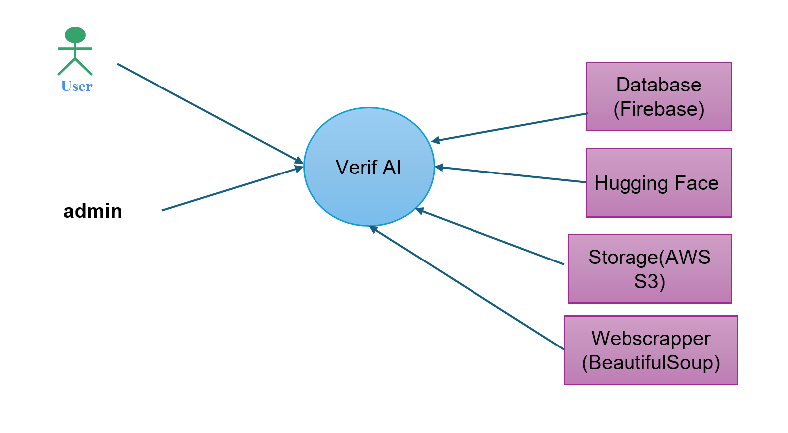
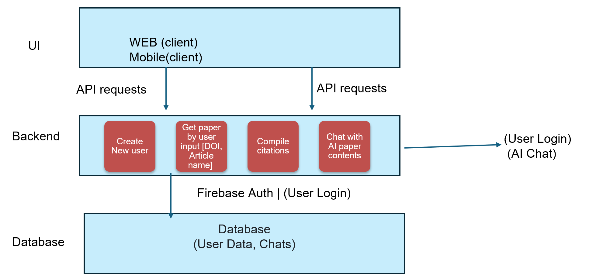
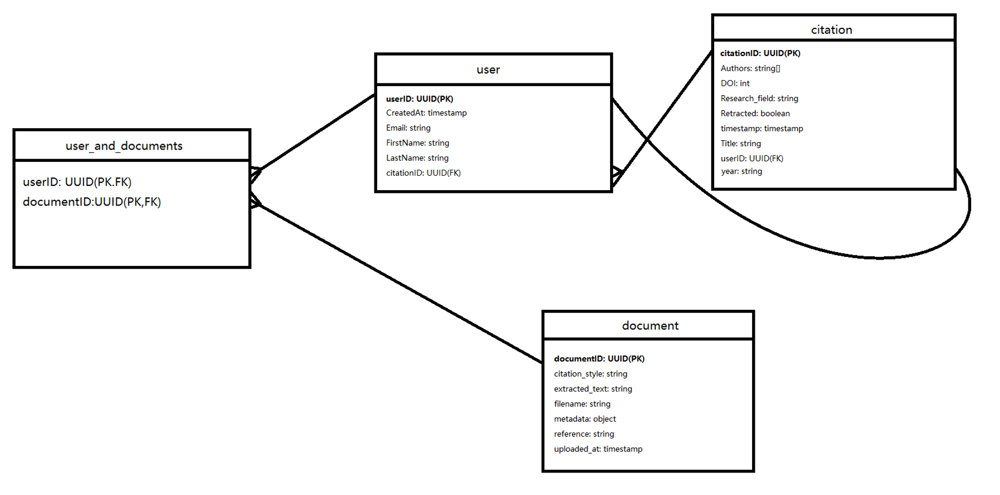

# VerifAI

## Table of Contents
- [Project Summary](#project-summary)
- [Installation](#installation)
- [Technology Stack](#technology-stack)
- [Access Frontend, Backend, WebScraper Documentation](#access-frontend-backend-webscraper-documentation)

## Project Summary  

**VerifAI** is an open-source AI-driven tool designed to enhance academic integrity by verifying research citations. It analyzes a paper’s references to determine:  

✅ Whether the paper actually cites the referenced sources  
✅ If the referenced sources are real, AI-generated, or retracted  
✅ The validity of claims attributed to each reference  

### Why VerifAI?  
- **Free & Open-Source** – Unlike paid alternatives like CiteSure, VerifAI is accessible to everyone  
- **Retracted Paper Detection** – Flags references that have been formally retracted  
- **AI-Generated Content Identification** – Identifies citations that may be hallucinated by AI models  
- **Condensed Source Suggestion** – Recommends compact sources when multiple references are similar  
- **Academic Integrity Support** – A comprehensive tool for students, researchers, and journal editors  

### Potential Use Cases  
- **Graduate Students** – Easily verify bibliography accuracy for theses and dissertations  
- **Academic Researchers** – Ensure research papers meet citation standards before submission  
- **Professors & Instructors** – Cross-check references in student work for accuracy  


## Installation
Clone this repository: ```bash git clone https://github.com/ShashankRaghuraj/VerfiAI.git cd verifai-backend ```

Install dependencies: ```bash npm install ```

Set up the environment variables:

Create a `.env` file in the root directory.
Add the following: ```ini GEMINI_API_KEY=<THE_KEY_HERE> ```
Start the server: ```bash npm start ```

## Technology Stack  

### Front End  
- **React.js** – Dynamic and interactive UI  
- **Bootstrap.js** – Responsive and visually appealing design  

### Back End  
- **Node.js with Express.js** – Handles server-side logic, API endpoints, and database interactions  

### Database & Storage  
- **Firebase** – Manages user authentication and data storage  
- **AWS S3** – Handles large-scale file uploads  

### Web Scraping & AI Processing  
- **BeautifulSoup** – Extracts citation data from web pages  
- **Hugging Face AI** – Classifies article genres to suggest relevant citations  

### Containerization  
- **Docker** – Ensures consistent deployment across environments  

## Access Frontend, Backend, WebScraper Documentation

You can find the detailed documentation for the **frontend**, **backend**, and **web scraper** below:

- [Frontend README](./frontend/README.md) – Learn more about the frontend setup and components. 
- [Backend README](./backend/README.md) – Discover the backend architecture, API endpoints, and server-side logic.
- [WebScraper README](./backend/scrapers/README.md) - Explore the web scraper setup, how it extracts citation data, and how to install it. 


## System Context Diagram


## Reference Architecture Diagram


## Database Diagram


## API Detail


